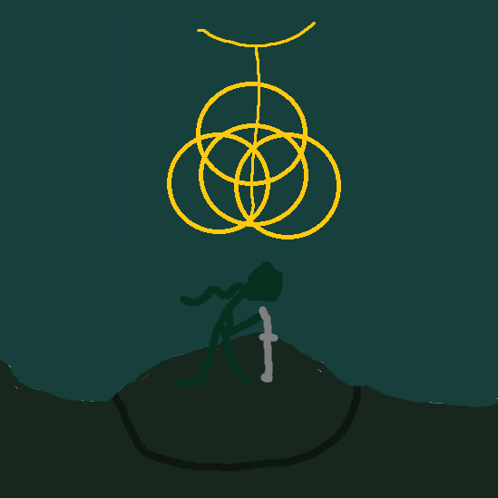
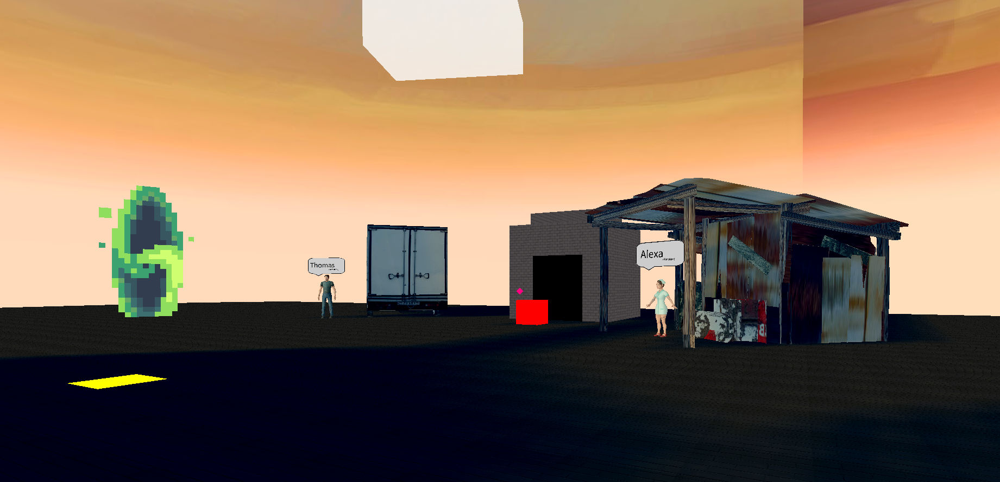

# WishDenRing



<h3>Un Dungeon Crawler 3D sous Python</h3>
<p>
  Développé avec le moteur <strong>Ursina</strong>,  <br/>
  WishDenRing est un jeu d'exploration de donjons. <br/>
  Votre objectif : combattre des monstres redoutables <br/>
  pour nettoyer les différentes zones et progresser <br/>
  à travers les niveaux.
</p>

<br>

<div align="center">
  
</div>

# 💻 Compatibilité

* [X] Windows
* [X] Linux (Ubuntu, Arch, etc.)
* [ ] MacOS

# Préparation au lancement

Création de l'environnement virtuel python pour pouvoir installer toutes les dépendances nécéssaires

```powershell
python -m venv .venv
```

Activer l'environnement virtuel python. Méthode qui peut varier selon le système d'exploitation

* Linux/MacOs:
  ```bash
  source ./.venv/bin/activate
  ```
* Windows:
  ```powershell
  ./.venv/Scripts/Activate.ps1
  ```

Installer toutes les dépendances nécésaires a tout le projet

```powershell
pip install -r requirements.txt
```

Executer le projet a travers le launcher

```powershell
python main.py
```

# Arguments de lancement pour le jeu

```powershell
python game.py --config configFile.json --multiplayer host/client --ipaddress ws://localhost:3030
```

`--config`: prend en paramètre le fichier de configuration pour le jeu `<br/>`
`--multiplayer`: definis le mode de connection pour le mode multijoueur host pour créer le serveur ou client pour s'y connecter `<br/>`
`--ipaddress`: définis l'addresse ip pour se connecter en cas de client pour un multi. Ne sert a rien si le mode de connection est définis sur host `<br/>`

# Fichier de configuration

```json
{
    "user": {
        "sensi": 45,
        "renderDistance": 40
    }
}
```
